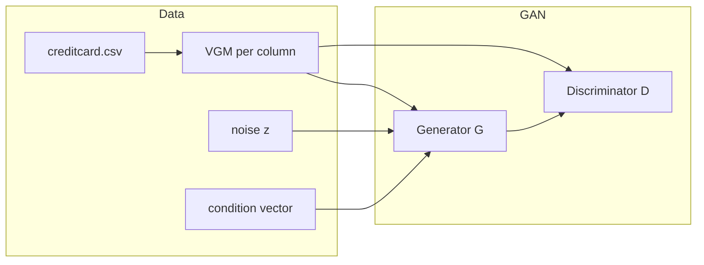

# AnalyticGAN

[](https://www.python.org/downloads/)
[](https://pytorch.org/)
[](https://opensource.org/licenses/MIT)

## Overview

**AnalyticGAN** is a conditional tabular generative adversarial network for the [Kaggle Credit Card Fraud Detection](https://www.kaggle.com/datasets/mlg-ulb/creditcardfraud) dataset. A **variational Gaussian mixture (VGM)** encoder represents each continuous column; the **generator** uses residual blocks and **self-attention** over the hidden representation; training follows **WGAN-GP** with spectral normalization in the discriminator and PacGAN-style packing.

The project includes **evaluation notebooks** (statistical fidelity, correlation, TSTR/TRTR, NNDR), a **classifier comparison** and **Streamlit** demo, and a **flow-matching** baseline on standardized features.

## Architecture



## Dataset

The **ULB Credit Card Fraud** dataset contains 284,807 transactions with 30 PCA-transformed features (`V1`–`V28`), `Time`, `Amount`, and binary `Class` (fraud). The positive class is highly imbalanced (~0.17% fraud). Data is loaded via **KaggleHub** (`mlg-ulb/creditcardfraud`).

## Results (summary)

| Component | Description |
|-----------|-------------|
| WGAN-GP + self-attention | 100-epoch Colab training; checkpoints `generator_final.pt`, `discriminator_final.pt` |
| Evaluation | `notebooks/05_evaluation.ipynb` → figures `figA`–`figE`, `ml_efficacy.csv` |
| Classifier demo | `notebooks/06_classifier_demo_report.ipynb` → `figF`, `figG`, `fraud_classifier.pkl` |
| Flow matching | `notebooks/07_flow_matching_baseline.ipynb` → `figH`–`figJ`, `flow_matching_comparison.csv` |

## Repository structure

```
analyticgan/
├── app/
│   └── streamlit_app.py       # 3-page demo (generate, classify, summary)
├── checkpoints/               # trained weights, preprocessor, figures, CSVs
├── notebooks/
│   ├── 01_eda.ipynb
│   ├── 02_preprocess.ipynb
│   ├── 03_model.ipynb
│   ├── 04_train.ipynb         # or 04_wgan_gp_training.ipynb (copy)
│   ├── 05_evaluation.ipynb
│   ├── 06_classifier_demo_report.ipynb
│   └── 07_flow_matching_baseline.ipynb
├── generate_checkpoints.py    # rebuild preprocessor.pkl, data_tensor.pt, cond_vec.npy
├── requirements.txt
└── README.md
```

## Quick start

1. **Install dependencies** (example with Anaconda):

   ```powershell
   C:\ProgramData\anaconda3\python.exe -m pip install -r requirements.txt
   ```

2. **Optional — rebuild local tensors** (if `preprocessor.pkl` / `data_tensor.pt` / `cond_vec.npy` are missing):

   ```powershell
   cd "path\to\analyticgan"
   python generate_checkpoints.py
   ```

3. **Run notebooks** in order: `05` → `06` → `07` (after `generator_final.pt` and `training_history.pkl` exist under `checkpoints/`).

4. **Streamlit**:

   ```powershell
   python -m streamlit run app/streamlit_app.py
   ```

## Generator checkpoint note

If the generator was saved after `torch.compile()`, load keys with the prefix stripped:

```python
_sd = torch.load("checkpoints/generator_final.pt", map_location=device)
_sd = {k.replace("_orig_mod.", ""): v for k, v in _sd.items()}
G.load_state_dict(_sd)
```

## References

- Arjovsky, M., Chintala, S., & Bottou, L. (2017). Wasserstein generative adversarial networks. *Proceedings of the 34th International Conference on Machine Learning*, 214–223.

- Gulrajani, I., Ahmed, F., Arjovsky, M., Dumoulin, V., & Courville, A. C. (2017). Improved training of Wasserstein GANs. *Advances in Neural Information Processing Systems*, 30.

- Xu, L., Skoularidou, M., Cuesta-Infante, A., & Veeramachaneni, K. (2019). Modeling tabular data using conditional GAN. *Advances in Neural Information Processing Systems*, 32.

- LeCun, Y., Bengio, Y., & Hinton, G. (2015). Deep learning. *Nature*, 521(7553), 436–444.

- Van der Maaten, L., & Hinton, G. (2008). Visualizing data using t-SNE. *Journal of Machine Learning Research*, 9(11), 2579–2605.
