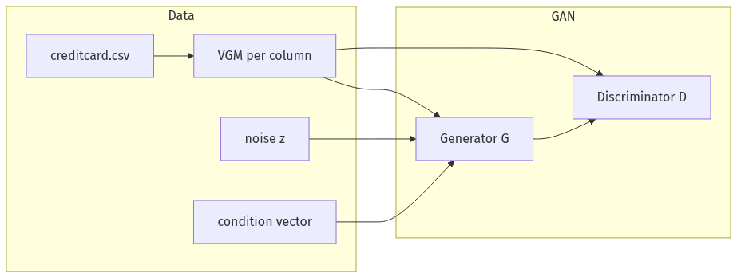
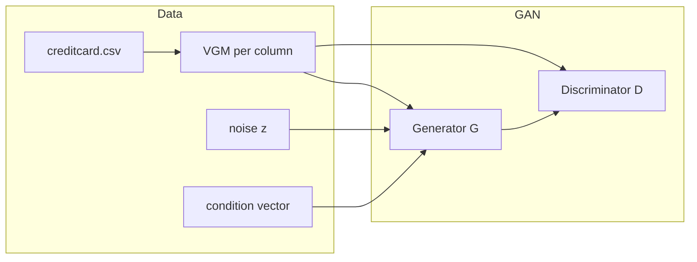

# AnalyticGAN

[](https://www.python.org/downloads/)
[](https://pytorch.org/)
[](https://opensource.org/licenses/MIT)

## Overview

**AnalyticGAN** is a conditional tabular GAN for the [Kaggle Credit Card Fraud Detection](https://www.kaggle.com/datasets/mlg-ulb/creditcardfraud) dataset. Each continuous column is encoded with a **variational Gaussian mixture (VGM)**; the **generator** uses residual MLP blocks and **self-attention**; training uses **WGAN-GP** with a spectrally normalized discriminator and PacGAN-style packing.

**What this project delivers:** a runnable pipeline—notebooks from EDA through training and baselines, **saved checkpoints and plots**, **quantitative CSV metrics**, and a **Streamlit** app that ties generation, classification, and summaries together. The sections below state **what we actually measured**, not only which model was used.

## Project outcomes (reportable results)

Values below are taken from `checkpoints/*.csv` produced by notebooks `05`–`07`.

### Fraud classifier: real vs synthetic vs mixed (`classifier_results.csv`)

| Setup | Accuracy | Precision | Recall | F1 | ROC-AUC |
|--------|----------|-----------|--------|-----|---------|
| Real only | 0.9995 | 0.961 | 0.7551 | 0.8457 | 0.9572 |
| Synthetic only | 0.9983 | 0.0 | 0.0 | 0.0 | 0.4586 |
| Mixed (best blend) | 0.9995 | 0.9595 | 0.7245 | 0.8256 | 0.9556 |

**Interpretation:** under this XGBoost setup, **synthetic-only** training did not produce a usable fraud detector (precision/recall collapsed to zero), while a **real + synthetic mix** remained close to **real-only** performance—a concrete limitation of the synthetic distribution for downstream classification.

### TRTR vs TSTR (`ml_efficacy.csv`)

| Setup | ROC-AUC |
|--------|---------|
| TRTR (train real, test real) | 0.9572 |
| TSTR (train synthetic, test real) | 0.4738 |

### Flow matching vs AnalyticGAN (`flow_matching_comparison.csv`)

| Metric | Flow matching | AnalyticGAN |
|--------|----------------|-------------|
| Mean JSD | 0.029 | 0.3124 |
| TSTR ROC-AUC | 0.4865 | 0.4738 |
| Mean NNDR | 0.8841 | 0.9711 |
| Training time (s) | 1620 | (see training notebook) |

### Statistical fidelity

Per-column real vs synthetic means, standard deviations, and ranges are in `stats_comparison.csv`. Evaluation plots include `figA_jsd.png`, correlation and NNDR figures (`figB*.png`, `figD_nndr.png`), and training curves (`figE_*.png`, `training_curves.png`).

## Architecture (figure for reports / GitHub)

Rendered diagram (export this path if you need a slide or PDF):



To **change or re-export** the image: copy the Mermaid below into [Mermaid Live Editor](https://mermaid.live) (or another Mermaid renderer), export PNG, and replace `checkpoints/architecture.png`.



## Dataset

The **ULB Credit Card Fraud** dataset has 284,807 rows: `V1`–`V28`, `Time`, `Amount`, and binary `Class` (~0.17% fraud). This repo loads it with **KaggleHub** (`mlg-ulb/creditcardfraud`). Do not commit raw `creditcard.csv`; download via KaggleHub or Kaggle as needed.

## Repository structure (what belongs where)

| Path | Role |
|------|------|
| `README.md` | Project summary, results, layout, how to run. |
| `requirements.txt` | Python dependencies. |
| `.gitignore` | Ignores caches, optional large binaries (see file). |
| `generate_checkpoints.py` | Rebuilds `preprocessor.pkl`, `data_tensor.pt`, `cond_vec.npy` from Kaggle without GAN training. |
| `app/streamlit_app.py` | Streamlit UI: generation, classifier, plots from `checkpoints/`. |
| `notebooks/01_eda.ipynb` … `07_flow_matching_baseline.ipynb` | Full pipeline; EDA figures `fig1_`–`fig8_` in `notebooks/`. |
| `checkpoints/` | Weights (`generator_final.pt`, `discriminator_final.pt`), `preprocessor.pkl`, `training_history.pkl`, `cond_vec.npy`, `arch_config.pkl`, `fraud_classifier.pkl`, result CSVs, and all evaluation figures (`figA_*.png`, …). |

**WGAN-GP hyperparameters** (for reference; training code lives in `04_wgan_gp_training.ipynb`): latent 128; generator/discriminator widths `[256, 256]`; PacGAN `pac=2`; batch size 500; Adam `lr=2e-4`, `β1=0.5`, `β2=0.9`; `n_critic=5`; `λ_gp=10`; 300 epochs in the example config used during development.

## Pipeline and main artifacts

| Step | Notebook | Primary outputs |
|------|----------|------------------|
| EDA / preprocess / model defs | `01`–`03` | `notebooks/fig1_*.png`–`fig8_*.png` |
| Train GAN | `04_wgan_gp_training.ipynb` | `generator_final.pt`, `discriminator_final.pt`, `training_history.pkl`, curves |
| Evaluate | `05_evaluation.ipynb` | `figA_jsd.png`, `figB*.png`, `figD_nndr.png`, `figE_*.png`, `stats_comparison.csv`, `ml_efficacy.csv` |
| Classifier study | `06_classifier_demo_report.ipynb` | `figF_roc.png`, `figG_feature_importance.png`, `fraud_classifier.pkl`, `classifier_results.csv` |
| Flow baseline | `07_flow_matching_baseline.ipynb` | `figH_*.png`, `figI_*.png`, `figJ_three_way.png`, `flow_matching_comparison.csv` |
| Demo | `app/streamlit_app.py` | (reads `checkpoints/`) |

## Quick start

1. **Install**

   ```powershell
   python -m pip install -r requirements.txt
   ```

2. **Optional — rebuild tensors** if `preprocessor.pkl` / `data_tensor.pt` / `cond_vec.npy` are missing:

   ```powershell
   cd "path\to\analyticgan"
   python generate_checkpoints.py
   ```

3. **Notebooks:** run `04_wgan_gp_training.ipynb`, then `05` → `06` → `07` once checkpoints exist.

4. **Streamlit** — run from the **`analyticgan`** folder (the one that contains `app/` and `checkpoints/`). If your path has spaces (e.g. `EAI-6020-Final Project`), quote it.

   ```powershell
   Set-Location "C:\Users\Owner\OneDrive\Desktop\EAI-6020-Final Project\analyticgan"
   python -m streamlit run .\app\streamlit_app.py
   ```

   One-liner alternative (full path to the script):

   ```powershell
   python -m streamlit run "C:\Users\Owner\OneDrive\Desktop\EAI-6020-Final Project\analyticgan\app\streamlit_app.py"
   ```

   Adjust the drive and folder names if your project lives under `Desktop` or `OneDrive\Desktop`.

## Generator weights (`torch.compile`)

If the generator was saved after `torch.compile()`, strip the prefix when loading:

```python
_sd = torch.load("checkpoints/generator_final.pt", map_location=device)
_sd = {k.replace("_orig_mod.", ""): v for k, v in _sd.items()}
G.load_state_dict(_sd)
```

## References

- Arjovsky, M., Chintala, S., & Bottou, L. (2017). Wasserstein generative adversarial networks. *ICML*.

- Gulrajani, I., et al. (2017). Improved training of Wasserstein GANs. *NeurIPS*.

- Xu, L., et al. (2019). Modeling tabular data using conditional GAN. *NeurIPS*.

- LeCun, Y., Bengio, Y., & Hinton, G. (2015). Deep learning. *Nature*.

- Van der Maaten, L., & Hinton, G. (2008). Visualizing data using t-SNE. *JMLR*.
